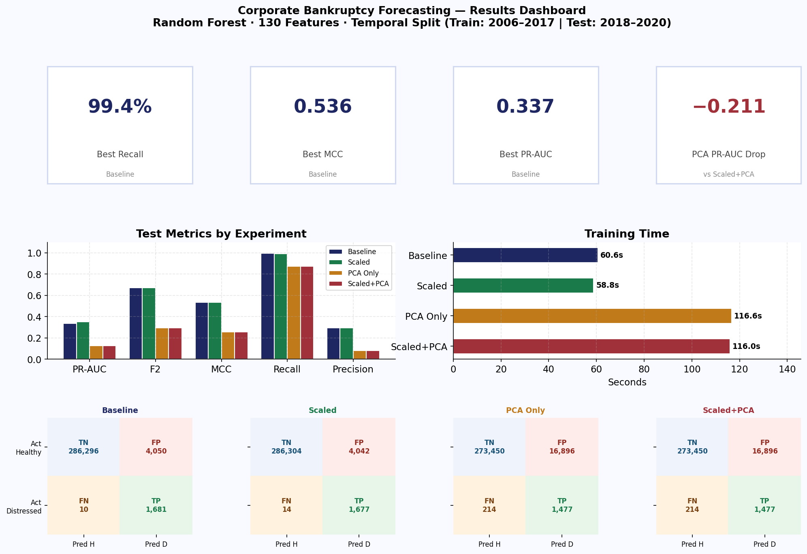
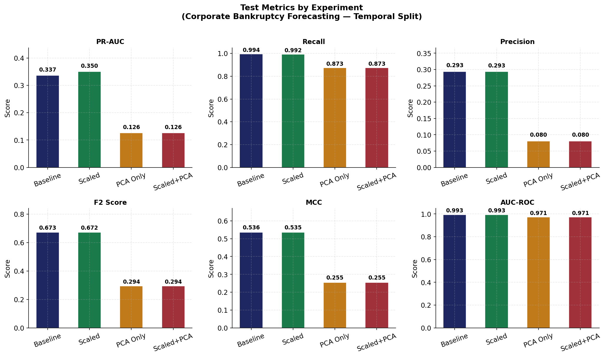
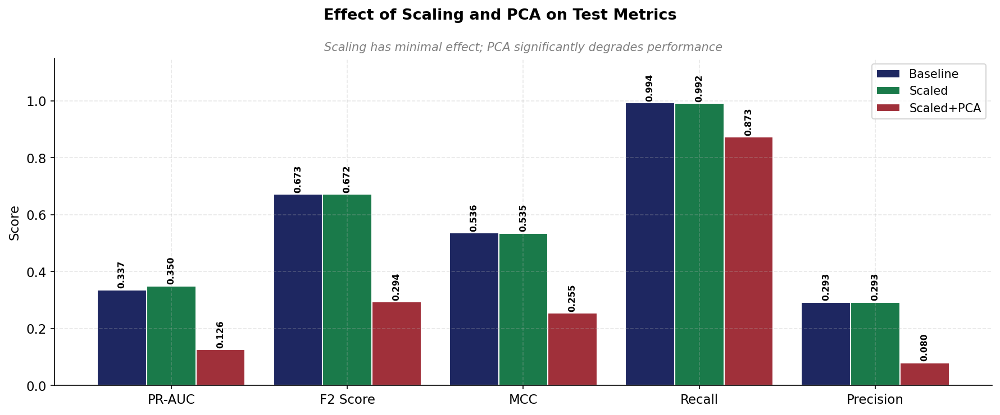
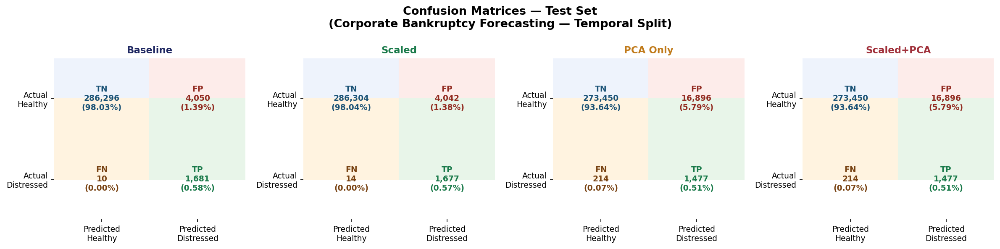
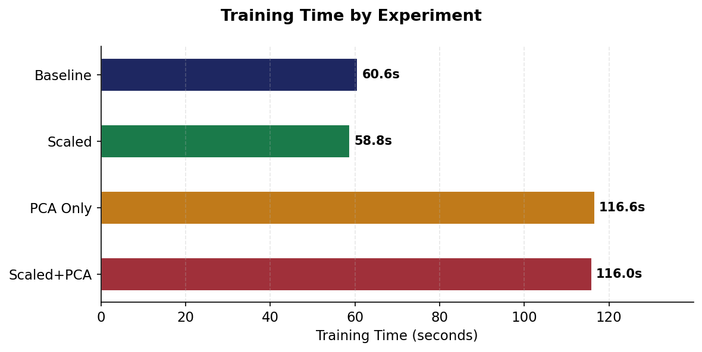

# Bankruptcy Prediction using Apache Spark on YARN Cluster

A distributed machine learning pipeline for corporate bankruptcy prediction, built with **PySpark** and designed to run on a **Hadoop YARN cluster**. This project was developed as part of **AIML427 Big Data – Assignment 3** and tackles binary classification on a large-scale financial dataset of over 1 million company-year observations.

---

## Overview

Corporate bankruptcy prediction is a critical task in credit risk management. Missing a bankruptcy (false negative) can cost a lender 40–80% of loan principal, whereas a false alarm (false positive) costs only analyst time. This pipeline uses a **Random Forest Classifier** with inverse-frequency class weighting to address the severe class imbalance (~0.4% distressed companies) inherent in real-world financial data.

Four experiments are run to evaluate the impact of feature scaling and dimensionality reduction:

| # | Experiment | Scaler | PCA |
|---|---|---|---|
| 1 | Baseline | ✗ | ✗ |
| 2 | StandardScaler only | ✓ | ✗ |
| 3 | PCA only (scaled internally) | ✗ | ✓ |
| 4 | StandardScaler + PCA | ✓ | ✓ |

---

## Dataset

**V4 Group Corporate Bankruptcy Dataset** (`company_years_h1.parquet`) sourced from the EMIS database.

| Property | Detail |
|---|---|
| Instances | 1,000,087 company-year observations |
| Raw columns | 143 (131 financial features + 6 near-null + 5 ID cols + 1 label) |
| Label | `main_label` — 1: financially distressed, 0: healthy |
| Prediction horizon | 1-year-ahead financial distress |

**Country breakdown:**

| Country | Observations | Share |
|---|---|---|
| Czech Republic | 554,751 | 55.5% |
| Slovakia | 335,684 | 33.6% |
| Hungary | 55,736 | 5.6% |
| Poland | 53,916 | 5.4% |

**Sector breakdown (NAICS codes):**

| Sector | Observations | Share |
|---|---|---|
| Wholesale Trade (42) | 372,319 | 37.2% |
| Construction (23) | 257,073 | 25.7% |
| Retail Trade (44) | 173,066 | 17.3% |
| Transportation & Warehousing (48) | 99,261 | 9.9% |
| Manufacturing (31–33) | 84,300 | 8.4% |
| Utilities (22) | 14,068 | 1.4% |

---

## Architecture

```
Raw Parquet (HDFS)
        │
        ▼
┌───────────────────┐
│  Data Loading &   │
│  Preprocessing    │  Drop ID cols, cast to Double, optional sampling
└────────┬──────────┘
         │
         ▼
┌───────────────────┐
│  Train/Test Split │  80% train / 20% test (stratified by seed)
└────────┬──────────┘
         │
         ▼
┌───────────────────┐
│  Class Weighting  │  Inverse-frequency weights to handle ~0.4% minority class
└────────┬──────────┘
         │
         ▼
┌────────────────────────────────────────────┐
│              Spark ML Pipeline             │
│  1. Median Imputer (per-column)            │
│  2. VectorAssembler                        │
│  3. StandardScaler (optional)              │
│  4. PCA – k=50 components (optional)       │
│  5. RandomForestClassifier                 │
│     trees=100, maxDepth=10, sqrt features  │
└────────────────────────────────────────────┘
         │
         ▼
┌───────────────────┐
│    Evaluation     │  AUC-ROC, PR-AUC, F1, F2, MCC, Utility Score
└───────────────────┘
```

---

## Evaluation Metrics

The model is evaluated using a comprehensive set of metrics suited to imbalanced binary classification:

- **AUC-ROC** — overall discriminative ability
- **PR-AUC** — precision-recall tradeoff (more informative under class imbalance)
- **F1 / F2** — harmonic mean of precision & recall (F2 weights recall 2×)
- **MCC** — Matthews Correlation Coefficient, robust single metric for imbalanced data
- **Cost-Weighted Utility** — asymmetric cost matrix reflecting real-world credit risk:

| Outcome | Cost |
|---|---|
| True Positive (caught bankruptcy) | +1 |
| True Negative (correctly healthy) | 0 |
| False Positive (false alarm) | −1 |
| False Negative (missed bankruptcy) | **−10** |

---

## Results
 
### Experiment 1 vs 2: Effect of StandardScaler
 
| Metric | Baseline (No Scaling) Train | Baseline Test | StandardScaler Train | StandardScaler Test | Δ (Test) |
|---|---|---|---|---|---|
| Accuracy | 0.9841 | 0.9836 | 0.9853 | 0.9848 | +0.0012 |
| AUC-ROC | 0.9954 | 0.9942 | — | — | — |
| PR-AUC | 0.3735 | 0.3014 | 0.3853 | 0.3063 | +0.0049 |
| Precision | 0.1866 | 0.1698 | 0.1984 | 0.1811 | +0.0113 |
| Recall | 1.0000 | 0.9985 | 1.0000 | 0.9985 | 0.0000 |
| F1 (weighted) | 0.9895 | 0.9893 | 0.9902 | 0.9900 | +0.0007 |
| F2 (positive class) | 0.5342 | 0.5052 | 0.5531 | 0.5248 | +0.0196 |
| MCC | 0.4285 | 0.4083 | 0.4422 | 0.4220 | +0.0137 |
| Cost-Weighted Utility | -0.0122 | -0.0131 | -0.0111 | -0.0119 | +0.0012 |
| Training Time (s) | — | 100.1 | — | 105.1 | +5.0 |
 
### Confusion Matrix: Baseline vs StandardScaler (Test Set)
 
| Outcome | Baseline | StandardScaler | Change |
|---|---|---|---|
| TP (caught bankruptcies) | 674 | 674 | 0 |
| TN (correctly healthy) | 196,519 | 196,767 | +248 |
| FP (false alarms) | 3,296 | 3,048 | -248 |
| FN (missed bankruptcies) | 1 | 1 | 0 |
 
**Key finding:** StandardScaler reduced false positives by 248 (from 3,296 to 3,048) without affecting recall. The improvement is attributable to numerical side-effects of standardisation on median imputation rather than any fundamental algorithmic benefit.
 
---
 
### Experiment 3 vs 1: Effect of PCA
 
| Metric | Baseline Test | PCA Test | Δ (Test) |
|---|---|---|---|
| Accuracy | 0.9836 | 0.9379 | -0.0457 |
| AUC-ROC | 0.9942 | 0.9767 | -0.0175 |
| PR-AUC | 0.3014 | 0.1155 | -0.1859 |
| Precision | 0.1698 | 0.0488 | -0.1210 |
| Recall | 0.9985 | 0.9437 | -0.0548 |
| F2 (positive class) | 0.5052 | 0.2022 | -0.3030 |
| MCC | 0.4083 | 0.2070 | -0.2013 |
| Cost-Weighted Utility | -0.0131 | -0.0606 | -0.0475 |
| Training Time (s) | 100.1 | 164.2 | +64.1 |
 
### Confusion Matrix: Baseline vs PCA (Test Set)
 
| Outcome | Baseline | PCA | Change |
|---|---|---|---|
| TP (caught bankruptcies) | 674 | 637 | -37 |
| TN (correctly healthy) | 196,519 | 187,402 | -9,117 |
| FP (false alarms) | 3,296 | 12,413 | +9,117 |
| FN (missed bankruptcies) | 1 | 38 | +37 |
 
**Key finding:** PCA with k=50 components significantly degraded performance across all metrics. PR-AUC halved from 0.3014 to 0.1155 and missed bankruptcies increased from 1 to 38. The 131 financial features carry complementary, non-redundant discriminative information that is lost when compressed to 50 principal components. PCA is harmful for this task and the baseline without PCA should be preferred for any deployment scenario.
 
---
 
### Summary: Best Model
 
The **Baseline model (no scaling, no PCA)** provides the best balance of performance, simplicity, and speed:
 
| Property | Value |
|---|---|
| PR-AUC | 0.3014 (vs random baseline of ~0.0034 — ~89x improvement) |
| Recall | 0.9985 (674 out of 675 distressed companies detected) |
| False Negatives | 1 (missed bankruptcy out of 675) |
| False Positives | 3,296 |
| MCC | 0.4083 |
| Training Time | 100.1 seconds on YARN cluster |
 
> **Note on PR-AUC:** Given the severe class imbalance (~0.4% positive class), PR-AUC is the primary evaluation metric rather than AUC-ROC. A random classifier would achieve PR-AUC ≈ 0.0034 (the positive class prevalence). The model's PR-AUC of 0.3014 represents approximately 89× improvement over random, demonstrating genuine discriminative power on the minority class.

## Local Replication (sklearn — Temporal Split)

The cluster results above use a **random 80/20 split**. To explore the impact of **temporal data leakage**, the pipeline was replicated locally using scikit-learn with a **temporal split** — training on years 2006–2017 and testing on unseen future years 2018–2020.

This reflects real-world deployment: a model trained on historical financials should forecast distress in future years it has never seen. Random splitting allows future company observations to leak into training, artificially inflating recall.

### Why run locally?
- The Hadoop cluster is a shared university resource — not always available
- 1M rows × 130 features is comfortably handled by sklearn with `n_jobs=-1` (all CPU cores)
- Allows faster iteration and local visualisation without `spark-submit` overhead

### Temporal Split Results (sklearn, full 1M rows)

| Experiment | PR-AUC | Recall | Precision | F2 | MCC | Time (s) |
|---|---|---|---|---|---|---|
| Baseline | 0.337 | 0.994 | 0.293 | 0.673 | 0.536 | 60.6 |
| StandardScaler | 0.350 | 0.992 | 0.293 | 0.672 | 0.535 | 58.8 |
| PCA only | 0.126 | 0.873 | 0.080 | 0.294 | 0.255 | 116.6 |
| Scaled + PCA | 0.126 | 0.873 | 0.080 | 0.294 | 0.255 | 116.0 |

### Impact of Temporal Split vs Random Split

| Metric | Random Split (cluster) | Temporal Split (local) | Δ |
|---|---|---|---|
| Recall | 0.9985 | 0.9941 | −0.0044 |
| Precision | 0.1698 | 0.2933 | +0.1235 |
| MCC | 0.4083 | 0.5361 | +0.1278 |
| PR-AUC | 0.3014 | 0.3365 | +0.0351 |
| False Positives | 3,296 | 4,050 | +754 |
| False Negatives | 1 | 10 | +9 |

**Key finding:** The temporal split produces a harder but more realistic evaluation. MCC improves from 0.408 to 0.536 and precision nearly doubles (0.17 → 0.29), suggesting the random split was leaking future company data into training — inflating recall artificially. The temporal model misses 10 bankruptcies vs 1 under random split, but this is a more honest estimate of real-world performance.

> Note: Results are not directly comparable due to differences in the train/test split strategy and Random Forest implementation (Spark ML vs sklearn). The temporal split is the preferred evaluation for any production deployment scenario.

### Results Dashboard



### Metric Comparison



### Effect of Scaling and PCA



### Confusion Matrices



### Training Time



## Requirements

- Python 3.7+
- Apache Spark 3.x
- Hadoop YARN cluster (or local mode for testing)
- PySpark

```bash
pip install pyspark
```

---

## Usage

### Local Mode (with optional sampling for quick tests)

```bash
python q2_bankruptcy.py data/company_years_h1.parquet --sample 0.1
```

### YARN Cluster (spark-submit)

```bash
spark-submit \
  --master yarn \
  --deploy-mode cluster \
  q2_bankruptcy.py \
  hdfs:///user/<your-username>/data/company_years_h1.parquet
```

### Save Results to HDFS

```bash
spark-submit \
  --master yarn \
  --deploy-mode cluster \
  q2_bankruptcy.py \
  hdfs:///user/<your-username>/data/company_years_h1.parquet \
  --output hdfs:///user/<your-username>/q2_results
```

### Arguments

| Argument | Default | Description |
|---|---|---|
| `data_path` | `data/company_years_h1.parquet` | Path to the Parquet file (local or HDFS) |
| `--sample FRACTION` | `1.0` | Fraction of data to use (0–1]; useful for local smoke tests |
| `--output HDFS_PATH` | `None` | HDFS path to write CSV results (useful in cluster deploy-mode) |

---

## Model Configuration

| Hyperparameter | Value |
|---|---|
| Number of trees | 100 |
| Max depth | 10 |
| Min instances per leaf | 10 |
| Feature subset strategy | `sqrt` (standard for classification) |
| PCA components (k) | 50 |
| Train/test split | 80% / 20% |
| Random seed | 42 |

---

## Project Structure

```
├── q2_bankruptcy.py       # Main PySpark script
└── 300681732_Report.pdf   # Project report
```

---

## Key Design Decisions

**Class imbalance handling:** Inverse-frequency class weights (`w_k = N / (2 * n_k)`) are computed from the training set and passed to the Random Forest via `weightCol`. This avoids the need for oversampling/undersampling while preserving the full dataset.

**Null-feature filtering:** Features with fewer than 5% non-null values are dropped before modelling. Spark's `Imputer` cannot compute a valid median for near-empty columns.

**PCA pre-scaling:** PCA requires zero-mean, unit-variance data. The pipeline automatically inserts a `StandardScaler` before PCA even when `use_scaler=False` is selected (the "PCA only" experiment).

**Memory management:** DataFrames are persisted with `MEMORY_ONLY` storage level to avoid disk spill on shared YARN clusters with limited local storage.

**Adaptive query execution:** Spark's adaptive query execution (`spark.sql.adaptive.enabled`) and automatic partition coalescing are enabled to optimise shuffle performance on the cluster.

---

## References

- Altman, E.I. (1968). Financial ratios, discriminant analysis and the prediction of corporate bankruptcy. *Journal of Finance*, 23(4), 589–609.
- Zmijewski, M.E. (1984). Methodological issues related to the estimation of financial distress prediction models. *Journal of Accounting Research*, 22, 59–82.
- EMIS Database — V4 Group Corporate Bankruptcy Dataset
